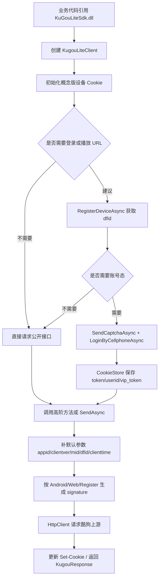

# KuGouMusicApi 转 C# DLL 流程

## 目标

把原 Node 项目的 HTTP Server 形态改成 .NET DLL：

- 不再启动 `/song/url`、`/search` 这类对外 URL。
- 只在 C# 内部封装酷狗上游请求。
- 固定为酷狗概念版：`platform=lite`、`appid=3116`、`clientver=11440`、概念版签名盐、概念版 RSA 公钥。
- 对外暴露 C# 方法、全量 API 目录和通用 `SendAsync` / `InvokeRouteAsync`。

## 总流程



## 与 Node 项目的对应关系

| Node 项目 | C# DLL |
|---|---|
| `server.js` 动态注册 Express 路由 | 不需要；由 C# 方法直接调用 |
| `module/*.js` 每个接口模块 | `KugouApiCatalog.All` 中的 155 个定义，常用接口另有高阶方法 |
| `util/request.js/createRequest` | `KugouLiteClient.SendAsync` |
| `util/helper.js` 签名 | `KugouCrypto.Signature*` |
| `util/crypto.js` AES/RSA/MD5 | `KugouCrypto` |
| 浏览器/HTTP cookie | `KugouCookieStore` |

## 一个接口的迁移模板

原 Node 模块大多长这样：

```js
module.exports = (params, useAxios) => {
  const dataMap = { ... };
  return useAxios({
    url: '/xxx',
    method: 'POST',
    data: dataMap,
    encryptType: 'android',
    headers: { 'x-router': 'xxx.kugou.com' },
    cookie: params?.cookie || {},
  });
};
```

C# 迁移为：

```csharp
var request = new KugouRequest
{
    Path = "/xxx",
    Method = HttpMethod.Post,
    Body = new Dictionary<string, object?>
    {
        ["field"] = value
    },
    EncryptType = KugouEncryptType.Android
};
request.Headers["x-router"] = "xxx.kugou.com";
return await client.SendAsync(request);
```

## 全量接口调用方式

原项目 155 个 `module/*.js` 已登记到 `KugouApiCatalog.All`，业务代码不需要再拼对外 HTTP URL，直接用路由键调用：

```csharp
using var client = new KugouLiteClient();

var response = await client.InvokeRouteAsync("/rank/list", new Dictionary<string, object?>
{
  ["withsong"] = 1
});

Console.WriteLine(response.BodyText);
```

原 README 中的输入参数说明也已抽取为参数目录：

```csharp
var parameterInfo = KugouApiParameterCatalog.Find("/song/url");
foreach (var item in parameterInfo?.Required ?? [])
{
  Console.WriteLine($"必选：{item.Name} - {item.Description}");
}
```

完整表格见 [api-parameter-reference.md](api-parameter-reference.md)。需要注意：原项目只有输入参数说明，没有稳定的输出字段表；输出通常是酷狗上游原始 JSON，不同登录态、版权状态、平台策略会导致结构变化。

通用调用器会根据目录里的定义处理：

1. 酷狗上游 `Path` / 绝对地址。
2. HTTP 方法。
3. `x-router`。
4. 参数默认走 query、body 或二者同时带上。
5. 概念版默认参数与签名。

特殊控制参数：

| 参数 | 作用 |
|---|---|
| `__upstreamPath` | 覆盖目录里的酷狗上游路径 |
| `__method` | 覆盖 HTTP 方法 |
| `__body` | 单独指定请求体 |
| `__clearDefaultParams` | 不自动附加默认 `appid/clientver/mid/dfid/clienttime` |
| `__notSignature` | 不生成 `signature` |
| `__encryptType` | 覆盖签名类型：`Android`、`Web`、`Register` |
| `header:xxx` | 附加请求头 `xxx` |
| `cookie:xxx` | 附加请求 cookie `xxx` |

## 登录/设备推荐流程

1. 创建 `KugouLiteClient`。
2. 调 `RegisterDeviceAsync()` 获取并保存 `dfid`。
3. 如果要账号态：
   - `SendCaptchaAsync(mobile)` 发送验证码。
   - `LoginByCellphoneAsync(mobile, code)` 登录。
   - DLL 自动解密 `secu_params`，保存 `token`、`userid`、`vip_token` 等。
4. 后续所有接口共用同一个 `KugouLiteClient` 实例。
5. 登录/刷新响应如果返回 `expires`，SDK 会记录 token 颁发时间并计算绝对到期时间；token 快过期时调用 `RefreshTokenAsync()`，如果接口返回 `error_code=20018` 或“登录已过期”，则需要重新扫码/重新登录。

## 已做出的核心链路

- 概念版设备初始化。
- 默认参数拼接：`dfid`、`mid`、`uuid`、`appid`、`clientver`、`clienttime`。
- 登录态参数拼接：`token`、`userid`。
- Android/Web/Register 三类 signature。
- 音乐 URL 所需 `key` 计算。
- 手机登录所需 AES + RSA Raw。
- 设备注册所需 playlist AES + RSA PKCS#1。
- KRC 歌词解码。
- `Set-Cookie` 更新到 `CookieStore`。
- token 到期元数据：`expires` 小数值按 TTL 秒计算，大数值按 Unix 秒/毫秒时间戳计算；可通过 `GetLoginState()` 判断是否已过期或是否建议刷新。

## 后续精细化建议

全量 155 个入口已经迁入目录和通用调用器；后续如果要更像 SDK，可以继续把某些接口做成强类型方法：

1. 给参数补强类型模型。
2. 把原 JS 里的默认值和字段改名逻辑固化到 C# 方法。
3. 对有二次解密/二次请求的接口补专用后处理。

## 注意点

- 原项目有少量模块参数名或拼写不一致，例如 `/ip/dateil`、`scene/list/v2` 文档与源码路径不一致，迁移时以 `module/*.js` 为准。
- 某些模块里存在 `notSign`/`notSignature` 命名不一致；C# DLL 使用明确的 `NotSignature` 或控制参数 `__notSignature`。
- 部分接口依赖 `dfid`；原 README 特别说明 `/song/url`、`/song/url/new` 前需要 `/register/dev`，否则可能返回“本次请求需要验证”。当前 SDK 的播放 URL 方法会自动调用 `EnsureDeviceRegisteredAsync()`，也可手动调用 `RegisterDeviceAsync()` 提前持久化设备态。
- 概念版“畅听/概念会员”权益是官方登录态权益，不是播放 URL 的本地绕过。EchoMusic 的个人中心会调用 `/youth/day/vip` 领取当天畅听会员，再调用 `/youth/day/vip/upgrade` 升级概念会员；Avalonia 客户端可按同一思路在播放前可选执行一次，失败时仍按普通播放 URL 流程继续。
- 新版播放 URL 可能返回加密音频，原项目也标注“目前无法解码”。
