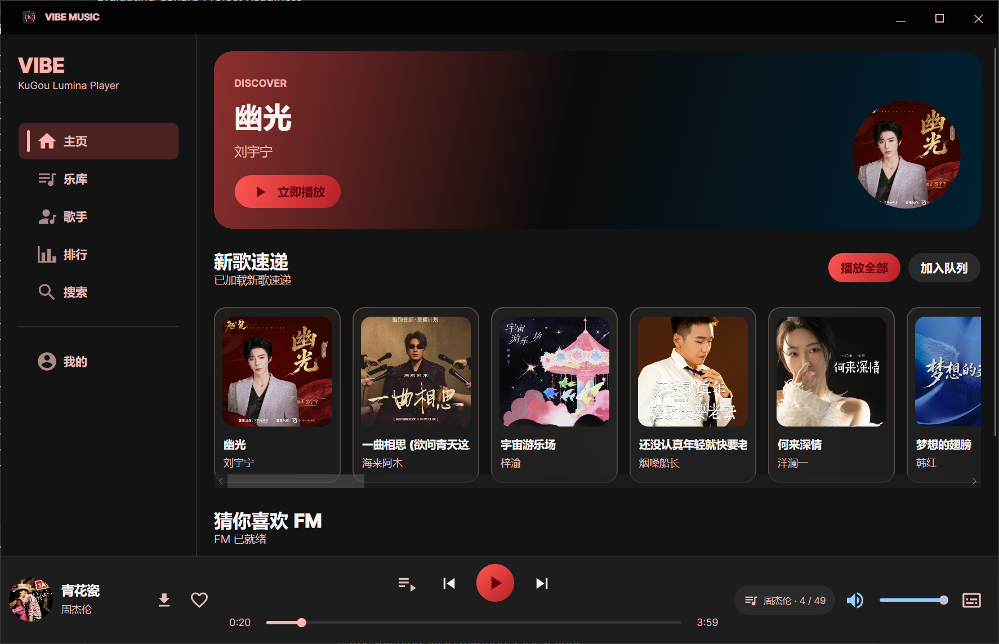
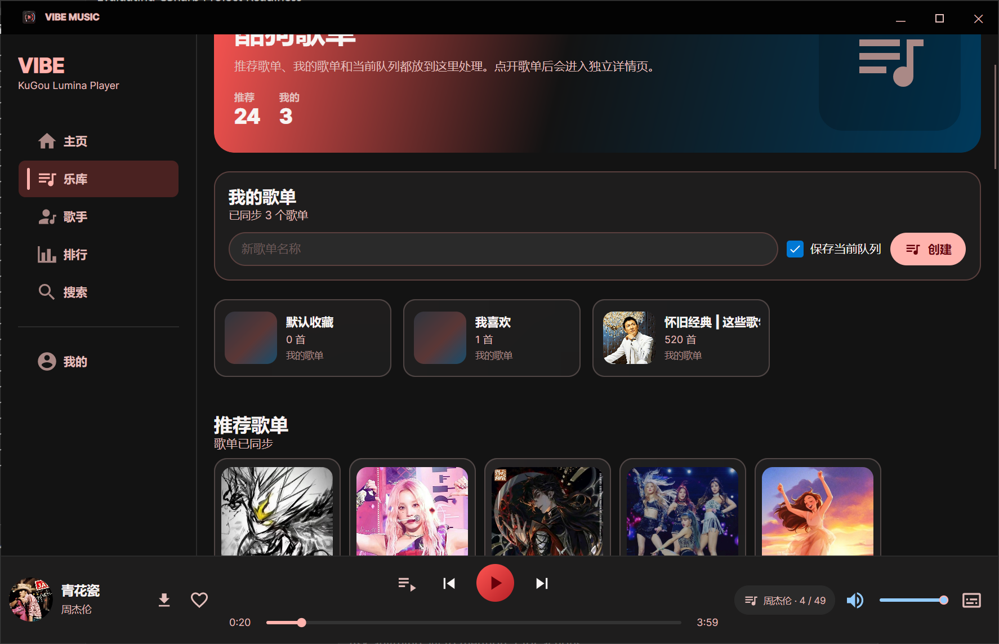
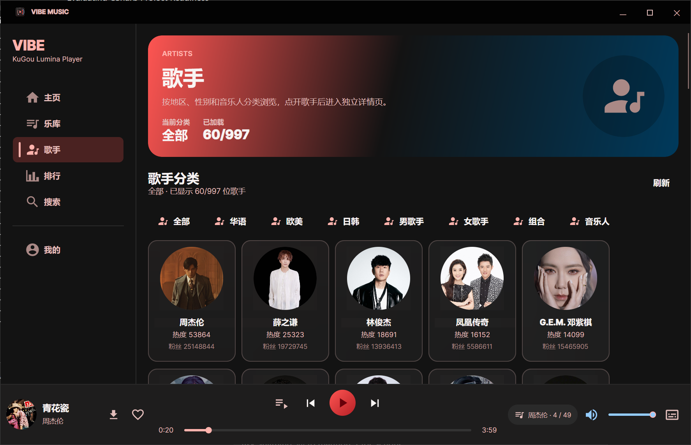
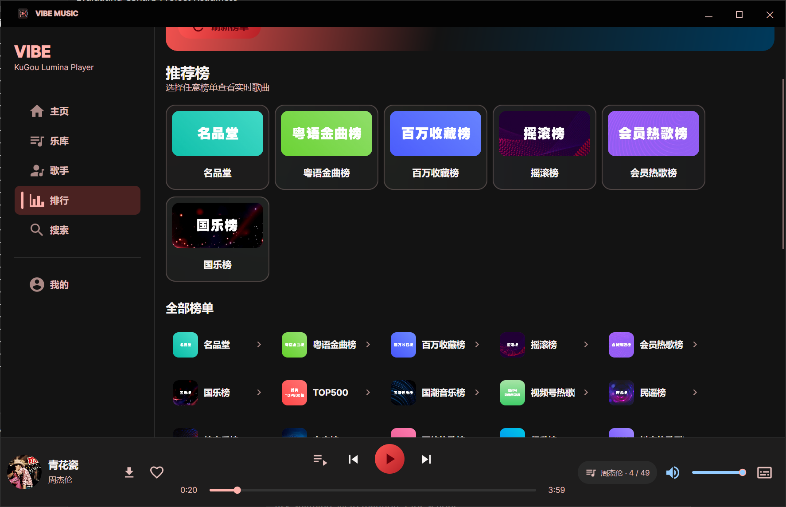
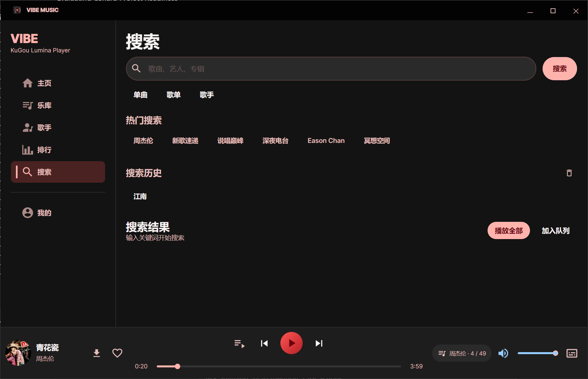

# VibeMusic (KuGou Music Avalonia)

VibeMusic 是一款基于 **Avalonia UI** 和 **.NET 10** 构建的现代化、跨平台第三方音乐客户端。
它不仅拥有令人惊艳的现代化用户界面，更提供了极其流畅的音乐播放体验，完美支持 Windows、macOS、Linux，还可以编译到 Android 和 iOS 平台。

## ✨ 核心特性

- **🎨 现代化 UI 设计**：采用精心打造的玻璃态半透明效果（Glassmorphism）、丝滑的过渡动画与微交互，呈现极具高级感的视觉体验。
- **📱 真正的跨平台**：一套 C# 代码，跨越 Desktop (Windows/Mac/Linux)、Android 和 iOS 多个生态。
- **🎵 核心音乐功能**：
  - 完整接入流媒体生态，支持账号登录、歌单同步、云盘/收藏管理。
  - 强大的本地历史播放记录，无缝回溯你的听歌历程。
  - 支持歌词滚动展示、桌面悬浮歌词、KRC / LRC 双轨歌词智能解析与首选切换，以及高度沉浸式的全屏播放页。
- **⚡ 高性能与虚拟化**：针对长列表（如数千首歌曲的历史记录、歌单）深度采用 UI 虚拟化技术，内存占用极小，无论数据多少滚动都丝滑不卡顿。
- **🛠 纯净的 C# 架构**：严格遵循 MVVM 设计模式，将核心业务逻辑、SDK 与 UI 完美解耦。

## 📦 项目结构

本项目主要包含以下核心模块：

- `KuGouLiteSdk`: 纯 C# 编写的基础 API SDK，负责所有的网络请求、数据解析与状态管理。
- `KuGouMusicAvalonia`: Avalonia 跨平台应用主工程，包含所有视图 (Views) 和业务逻辑 (ViewModels)。
  - `KuGouMusicAvalonia.Desktop`: 桌面平台宿主启动项目。
  - `KuGouMusicAvalonia.Android`: 安卓平台宿主启动项目。
  - `KuGouMusicAvalonia.iOS`: iOS 平台宿主启动项目。

> 注：本项目为纯 C# 原生实现，不依赖任何 WebView 或前端（JavaScript/HTML/CSS）技术栈。

## 🚀 编译与运行

### 环境要求
- **.NET 10 SDK** (或对应的最新版本)
- (可选) Avalonia UI IDE 插件

### 运行桌面端

直接使用 `dotnet run` 即可在本地启动跨平台桌面版：

```powershell
# 定位到桌面项目目录并启动
cd KuGouMusicAvalonia/KuGouMusicAvalonia.Desktop
dotnet run
```

### 构建与打包

```powershell
# 编译桌面端发布版本
dotnet build KuGouMusicAvalonia/KuGouMusicAvalonia.Desktop/KuGouMusicAvalonia.Desktop.csproj -c Release
```

完整的解决方案配置位于 `KuGouMusic.slnx`。如果需要编译 Android 或 iOS 版本，请确保你已经安装了对应的 .NET 移动端工作负载，以及本地构建所需的底层工具链（如 Xcode / Android SDK）。

## 📸 界面预览

### 🎵 首页推荐


### 📂 我的歌单


### 🎤 歌手库


### 🏆 排行榜


### 🔍 搜索页


## 📄 声明

本项目仅供学习交流 Avalonia UI 与跨平台 .NET 开发技术使用。