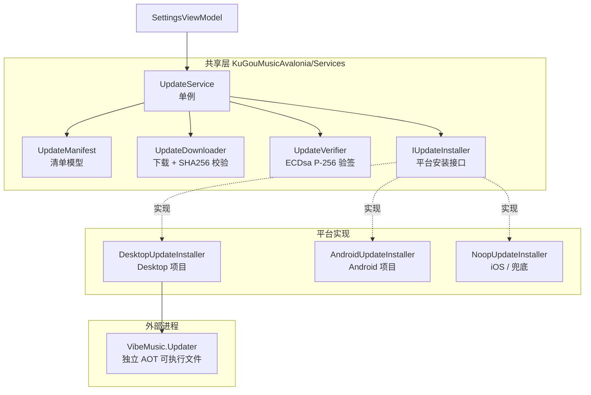
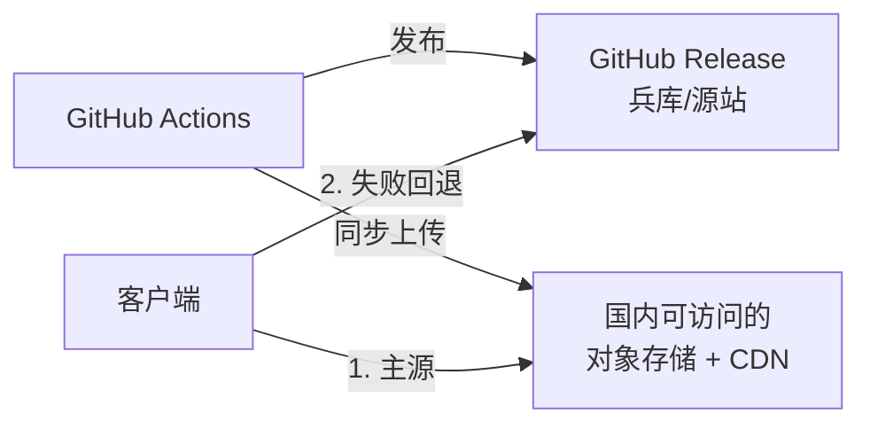
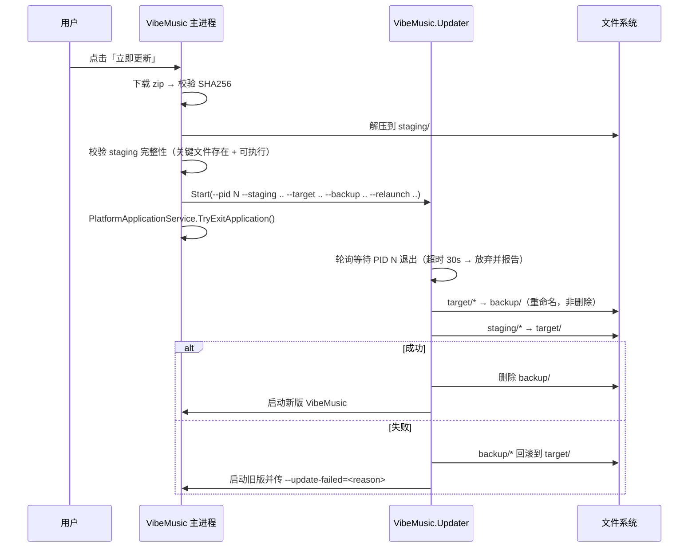

# VibeMusic 跨平台自动升级设计方案

> 状态：设计稿，尚未实现
> 覆盖平台：Windows / Linux / macOS / Android（iOS 仅降级提示）

---

## 1. 背景与现状

当前发布链路已经具备实现自更新的全部前提条件：

| 事项 | 现状 | 位置 |
|---|---|---|
| 版本单一来源 | `Version` = 1.2.0，`AppVersionCode` = 10 | `KuGouMusicAvalonia/Directory.Build.props` |
| 发布触发 | push 到 master 且改动 `Directory.Build.props` → 自动打 tag 发版 | `.github/workflows/release-aot.yml` |
| 桌面产物 | AOT + self-contained + trimmed，打包为 `vibemusic-{version}-{rid}.zip`，RID = `win-x64` / `linux-x64` / `osx-x64` / `osx-arm64` | 同上 `build` job |
| macOS 产物 | `VibeMusic.app` bundle（未做 codesign / notarize） | 同上 |
| Android 产物 | `vibemusic-{version}-{abi}.apk`，ABI = `arm64-v8a` / `armeabi-v7a`，使用固定 keystore 签名 | 同上 `build-android` job |
| 分发形态 | GitHub Release 附件，桌面端为**绿色便携包**（无安装器、无注册表写入） | — |

绿色包 + 固定命名 + 固定签名密钥这三点，让自更新的实现复杂度显著低于常规安装器场景。

### 现有可复用的代码资产

- **平台服务抽象模式**：`Services/PlatformAudioStorage.cs`（共享接口 + `Initialize()` 注入平台实现）、`Services/PlatformApplicationService.cs`（委托式退出钩子）、`Services/FloatingLyricsService.cs`（桌面/Android 双实现的统一入口）。升级服务应完全沿用这套模式，不引入新的 DI 容器。
- **带进度的流式下载**：`Services/AudioCacheService.cs` 中 `DownloadCoreAsync` 已实现 `HttpCompletionOption.ResponseHeadersRead` + 128KB 缓冲 + `IProgress<DownloadProgressInfo>` + 临时文件（`.download` 后缀）+ 失败清理。升级下载可直接复用同一模式。
- **退出应用能力**：`PlatformApplicationService.TryExitApplication()`，桌面端替换文件前必须调用。
- **设置页承载点**：`ViewModels/SettingsViewModel.cs` + `Views/SettingsView.axaml`，已有 `IsCompactLayout` 自适应布局，可直接挂载「检查更新」区块。

---

## 2. 可行性结论

| 平台 | 可行性 | 核心机制 | 主要障碍 |
|---|---|---|---|
| Windows | ✅ 完全可行 | 外部 updater 进程做目录替换 | 运行中的 exe / 已加载 native dll 不可删除 |
| Linux | ✅ 完全可行 | 同上 | 需保留可执行位 |
| macOS | ⚠️ 可行 | `ditto` 替换整个 `.app` | quarantine 属性；未签名导致 Gatekeeper 拦截 |
| Android | ✅ 可行 | 下载 APK → `PackageInstaller` 覆盖安装 | 需 `REQUEST_INSTALL_PACKAGES` + `FileProvider` + 用户确认 |
| iOS | ❌ 不可行 | 仅能打开外部下载/商店页面 | 平台沙箱禁止 |

---

## 3. 总体架构



### 职责边界

- **共享层**只负责：拉清单 → 验签 → 比版本 → 挑资产 → 下载 → 校验哈希 → 移交 installer。全程不碰任何平台 API。
- **平台 installer** 只负责：拿到一个已校验的本地文件，把它变成「已安装」。
- **外部 updater** 只负责：等主进程退出 → 原子替换目录 → 重启。它不联网、不下载、不解析清单，攻击面最小。

---

## 4. 更新清单（latest.json）

### 4.1 为什么不用 GitHub Releases API

| 方案 | 优点 | 缺点 |
|---|---|---|
| 直接调 `/repos/{owner}/{repo}/releases/latest` | 零维护 | 匿名限速 60 次/小时/IP；无官方哈希字段；资产名解析脆弱；响应体大 |
| **CI 生成 `latest.json`**（采用） | 体积小、可带哈希与签名、可携带更新日志与强制升级标记、可自托管加速 | 需在 workflow 里多加一步 |

**决策：采用 CI 生成 `latest.json`。**

### 4.2 Schema

```jsonc
{
  "schema": 1,
  "version": "1.3.0",
  "versionCode": 11,            // Android versionCode，桌面端忽略
  "publishedAt": "2026-08-01T10:00:00Z",
  "mandatory": false,           // true 时不允许「稍后再说」
  "minSupportedVersion": "1.0.0", // 低于此版本无法增量升级，需引导手动重装
  "releaseNotes": "- 修复播放完成不自动下一首\n- 新增自动升级",
  "assets": [
    {
      "platform": "win-x64",    // 桌面：RID；Android：ABI
      "kind": "zip",            // zip | app-zip | apk
      "fileName": "vibemusic-1.3.0-win-x64.zip",
      // 按顺序尝试，第一个可用的生效；国内源在前
      "urls": [
        "https://cdn.example.com/vibemusic/v1.3.0/vibemusic-1.3.0-win-x64.zip",
        "https://github.com/<owner>/<repo>/releases/download/v1.3.0/vibemusic-1.3.0-win-x64.zip"
      ],
      "size": 48213504,
      "sha256": "3f8a...",
      "executable": "VibeMusic.exe"  // 替换后用于重启，桌面端专用
    },
    { "platform": "linux-x64",  "kind": "zip",     "...": "..." },
    { "platform": "osx-arm64",  "kind": "app-zip", "...": "..." },
    { "platform": "arm64-v8a",  "kind": "apk",     "...": "..." },
    { "platform": "armeabi-v7a","kind": "apk",     "...": "..." }
  ]
}
```

注意 `urls` 是**数组**而非单一字符串 —— 这是应对国内网络环境的关键设计，详见第 4.4 节。由于所有 URL 都在签名保护的清单内，镜像源无法被中途插入。

同目录再发布一个 `latest.json.sig`（base64 编码的签名），或把签名内联为 `latest.json` 的兄弟字段（需签名规范化后的 payload，避免 JSON 序列化歧义 —— **推荐用分离的 `.sig` 文件对原始字节签名**，实现最简单也最不易错）。

### 4.3 清单获取地址

同样采用**多源回退**，客户端内置一个有序源列表：

```
1. https://cdn.example.com/vibemusic/latest.json              国内对象存储/CDN（主源）
2. https://<中转服务>/api/v1/check?...                      自建中转（可选，支持灰度）
3. https://github.com/<owner>/<repo>/releases/latest/download/latest.json   兵库源
```

第 3 条的 `releases/latest/download/<name>` 是 GitHub 的稳定重定向，永远指向最新 release 的同名资产，无需调 API、无速率限制 —— 但**国内网络环境下基本不可用**，只能作为兵库。

### 4.4 国内分发方案（关键约束）

GitHub 在国内不可靠访问，因此**不能把 GitHub Release 作为唯一分发源**。候选方案对比：

| 方案 | 国内速度 | 成本 | 运维 | 评价 |
|---|---|---|---|---|
| **Cloudflare R2 + 自定义域名** | 中等 | 存储极低，**出站流量完全免费** | 低 | 成本最优解，推荐作为主源 |
| 阿里云 OSS / 腾讯云 COS | 快 | 流量约 0.5 元/GB，50MB 包 × 1000 次 ≈ 25 元 | 低 | 需备案域名，体验最好 |
| 七牛云 Kodo | 快 | 有免费额度 | 低 | 需备案域名 |
| 自建反代转发 GitHub | 不稳定 | 服务器 + 双向流量 | 中 | 服务器到 GitHub 也可能慢，不推荐单独使用 |
| 公共 ghproxy 镜像 | 波动大 | 免费 | 零 | 随时可能失效/限速，**只能当傅底**，不能当主源 |
| Gitee Release | 快 | 免费 | 低 | 需实名，附件大小/API 有限制，仓库可能被审核封禁 |

**推荐组合：CI 双推 + 客户端多源回退**



客户端回退策略：
- 每个源设独立超时（清单 8s，下载不设总超时但设 30s 空闲读超时）；
- 任一源返回的内容都要过**同一套验签与哈希校验**，因此镜像源不可信也无妨；
- 下载失败自动换下一个源重试，已下载字节可通过 `Range` 请求续传（需源站支持，对象存储普遍支持）；
- 记录上次成功的源并优先使用，避免每次都卡在不可达的源上。

> 安全性说明：引入镜像源**不降低**安全性，因为信任链的根是内置公钥，而非传输通道。镜像站即使被入侵，篡改后的清单过不了验签，篡改后的产物过不了 SHA256。

### 4.5 推送式镜像 vs 拉取式中转

两种形态都已实现，**可以只选一种，也可以两个都开**（客户端本来就是多源回退）。

| | 推送式镜像 | 拉取式中转 |
|---|---|---|
| 做法 | CI 发版时把产物 `aws s3 cp` 上传到对象存储 | 部署一个代理，客户端请求它，它实时回源 GitHub |
| 首次下载 | 快（产物已经在国内） | 慢（要等回源），之后走边缘缓存 |
| 成本 | 存储 + 流量 | Cloudflare Workers 免费额度 10 万请求/天 |
| 需要域名备案 | 用国内云厂商时需要 | 不需要 |
| 需要服务器 | 不需要 | 不需要（Serverless） |
| 存储上限 | 无 | 无（不落盘） |
| 失效风险 | 低 | Cloudflare 国内路由波动 |
| 实现位置 | `release-aot.yml` 的 `Sync assets to China mirror` 步骤 | `deploy/mirror-worker/` |

#### 拉取式中转（`deploy/mirror-worker/`）

一个 Cloudflare Worker，把固定形状的路径回源到 GitHub Release：

```
GET /latest.json        ->  github.com/<repo>/releases/latest/download/latest.json
GET /latest.json.sig    ->  同上
GET /v1.2.0/vibemusic-1.2.0-win-x64.zip
                        ->  github.com/<repo>/releases/download/v1.2.0/vibemusic-1.2.0-win-x64.zip
```

这套路径**刻意**与 CI 拼 URL 的方式 `{UPDATE_MIRROR_BASE_URL}/{tag}/{fileName}`、以及客户端拉清单的
`{MirrorBaseUrl}/latest.json` 完全对齐。所以启用中转只需要：

1. 在 `deploy/mirror-worker/wrangler.toml` 填 `GITHUB_REPOSITORY`；
2. `npx wrangler deploy`，绑一个自定义域（`*.workers.dev` 在国内解析常被污染）；
3. GitHub 仓库设置里把变量 `UPDATE_MIRROR_BASE_URL` 设成该域名；
4. 客户端 `UpdateEndpoints.MirrorBaseUrl` 填同一个域名。

**不要**设置 `UPDATE_MIRROR_BUCKET`，CI 的对象存储同步步骤会自动跳过 —— 中转是实时回源的，不需要预先上传。

几个关键设计点：

- **路径必须白名单**。如果允许任意路径透传，它立刻变成公开的匿名代理，会被拿去刷流量、绕墙甚至打第三方，账号很快被封。Worker 里用 `TAG_PATTERN` / `ASSET_PATTERN` 严格限定形状，其余一律 404。
- **`latest.json` 走 `no-cache`，产物走 `immutable` 长缓存**。清单缓存久了会让用户在缓存过期前一直查不到新版本；带版本号的产物内容永不变，可以放心长缓存。
- **`Range` 请求透传且不进边缘缓存**，保证断点续传可用，同时避免 206 部分响应污染完整响应的缓存条目。

#### 什么时候该上推送式

中转的瓶颈在「Cloudflare 边缘 → GitHub」这一跳，冷启动时用户要等它跑完。如果用户量起来、或者对首次下载速度不满意，再叠加推送式：配好 `UPDATE_MIRROR_*` 系列变量，CI 会把产物直传对象存储，此时把 `UPDATE_MIRROR_BASE_URL` 指向对象存储的公开域名即可。两者的 URL 形状一致，切换不需要改客户端代码。

---

## 5. 版本比较策略

```csharp
// 共享层
public static bool IsNewer(string remote, string local);
```

- 桌面端：用 `System.Version.Parse` 比较 `latest.json.version` 与 `Assembly.GetEntryAssembly()!.GetName().Version`（或 `InformationalVersion`，注意剥离 `+commit` 后缀）。
- Android 端：优先比较 `versionCode`（整数，单调递增，最可靠），退化时才比较字符串版本。`versionCode` 通过 `PackageManager.GetPackageInfo(...).LongVersionCode` 取得。
- 预发布/构建元数据（`1.3.0-beta.1`、`1.3.0+abc123`）：当前版本方案未使用，比较前统一截断到前三段数字即可。

---

## 6. 桌面端更新流程

### 6.1 目录布局

```
<安装目录>/                      # 用户解压 zip 得到的位置，如 D:\Apps\VibeMusic
├── VibeMusic.exe
├── VibeMusic.Updater.exe        # 随包发布的独立可执行文件
├── libSkiaSharp.dll
├── libaudio_player.dll
├── .update-backup/              # 替换过程中的旧版本，成功后删除，失败时回滚
└── ...

%LOCALAPPDATA%/KuGouMusicAvalonia/update/
├── download/                     # 下载中的 .part 与校验通过的安装包
└── staging/                      # 解压后的完整新版本目录
```

> **备份目录必须放在安装目录内部**，不能放到 `%LOCALAPPDATA%`。跨卷的「移动」会退化成复制 + 删除，
> 而删除正在运行的 exe / 已加载的 dll 必定失败。只有同卷重命名才能绕开文件占用。
> updater 遍历安装目录时需排除 `.update-backup` 自身。

> 注：现有 `AppStateStore.AppDirectory` 用的是 `ApplicationData`（漫游目录）。升级临时文件体积大且机器相关，应放 `LocalApplicationData`，不要复用漫游目录。

### 6.2 时序



### 6.3 平台细节

**Windows**
- 正在运行的 `.exe` 和已被 `LoadLibrary` 映射的 `.dll`（`libSkiaSharp.dll`、`libaudio_player.dll`、FFmpeg 的 `av*.dll`）**不能删除，但可以在同一卷内重命名**。因此替换策略必须是「先 rename 旧文件到 backup，再写入新文件」，绝不能先 delete。
- Updater 自身也在 target 目录内 → 它必须先把自己拷贝到临时目录再启动，否则无法替换自己。启动参数需带 `--self-copied` 标记以免无限递归。
- 等待主进程退出用 `Process.GetProcessById(pid).WaitForExit(30_000)`，注意进程可能已退出导致 `ArgumentException`，需捕获并视为成功。

**Linux**
- inode 语义允许覆盖正在运行的文件，但仍建议统一走 rename 策略保持代码一致。
- 解压后必须 `chmod +x` 主程序和所有 `.so`；.NET 的 `ZipFile.ExtractToDirectory` **不保留 Unix 权限位**，这是最常见的踩坑点。需要读取 zip entry 的 `ExternalAttributes` 高 16 位手动恢复，或统一对已知可执行文件设权限。
- Zip Slip 防护：解压前必须校验每个 entry 的解析后完整路径仍在目标目录内。

**macOS**
- 替换对象是整个 `VibeMusic.app` 目录，必须用 `ditto` 或 `cp -R` 保留符号链接、权限与扩展属性；`ZipFile.ExtractToDirectory` 会破坏 bundle 结构（丢失符号链接）。建议 updater 在 macOS 上直接 shell out 到 `ditto -x -k <zip> <dest>`。
- 从网络下载的文件带 `com.apple.quarantine` 扩展属性，未签名/未公证的 app 会被 Gatekeeper 报「已损坏」。替换后需执行 `xattr -dr com.apple.quarantine <app>`。
- 由于 app 未 codesign，即使自更新成功，首次启动仍可能需要用户右键「打开」。**长期方案是给 CI 加 codesign + notarize**，否则 macOS 自更新体验始终不完整。
- `.app` 内部路径下的可执行文件位于 `Contents/MacOS/VibeMusic`，重启命令应为 `open -a <path-to-.app>`。

---

## 7. Android 更新流程

APK 无法自我覆盖，只能走系统安装器。签名一致（CI 使用同一 keystore）是覆盖安装的前提，这一点已满足。

### 7.1 步骤

1. **ABI 选择**：读 `Android.OS.Build.SupportedAbis`，取第一个能在清单 assets 里匹配到的（优先 `arm64-v8a`，退化 `armeabi-v7a`）。
2. **下载位置**：`Context.GetExternalFilesDir(null)` 下的 `update/` 子目录 —— 应用私有外部目录，**无需任何存储权限**，且卸载时自动清理。
3. **权限检查**（API 26+）：
   ```csharp
   if (!PackageManager.CanRequestPackageInstalls())
   {
       var intent = new Intent(Settings.ActionManageUnknownAppSources,
           Android.Net.Uri.Parse("package:" + PackageName));
       StartActivityForResult(intent, RequestInstallPermission);
       return; // 用户授权后回到 OnActivityResult 再继续
   }
   ```
4. **Manifest 声明**（`KuGouMusicAvalonia.Android/Properties/AndroidManifest.xml`）：
   ```xml
   <uses-permission android:name="android.permission.REQUEST_INSTALL_PACKAGES" />

   <provider
       android:name="androidx.core.content.FileProvider"
       android:authorities="${applicationId}.fileprovider"
       android:exported="false"
       android:grantUriPermissions="true">
     <meta-data android:name="android.support.FILE_PROVIDER_PATHS"
                android:resource="@xml/file_paths" />
   </provider>
   ```
   配套 `Resources/xml/file_paths.xml` 暴露 `external-files-path` 下的 `update/`。
5. **触发安装**（二选一）：

   | 方式 | 说明 |
   |---|---|
   | `Intent.ActionView` + `application/vnd.android.package-archive` + FileProvider content URI + `FlagGrantReadUriPermission` | 实现最简单，兼容性最好 |
   | `PackageInstaller` Session API | 更现代，可通过 `IntentSender` 拿到安装结果回调，能区分「用户取消」与「安装失败」。**推荐** |

6. **安装后**：系统会杀掉旧进程并以新版本重启（用户点击「打开」）。无需应用侧做任何重启逻辑。

### 7.2 额外安全校验

下载完成后，除 SHA256 外，还应校验 APK 的签名证书指纹与当前运行应用一致：

```csharp
// 取当前应用签名指纹
var current = PackageManager.GetPackageInfo(PackageName, PackageInfoFlags.SigningCertificates);
// 取待安装 APK 的签名指纹
var candidate = PackageManager.GetPackageArchiveInfo(apkPath, PackageInfoFlags.SigningCertificates);
// 比较 SHA-256(cert.ToByteArray())，不一致则拒绝安装并删除文件
```

这可以拦截「下载源被替换成同名恶意 APK」的场景 —— 即便签名不同的 APK 本来就装不上去，提前拦截也能避免把恶意文件落到用户设备上并弹出安装框。

### 7.3 已知限制

- Android 12+ 若目标 SDK ≥ 31，`PackageInstaller` 的 `IntentSender` 回调需要 `PendingIntent` 显式指定 `PendingIntentFlags.Mutable` 或 `Immutable`，遗漏会直接崩溃。
- 部分厂商 ROM（MIUI、ColorOS 等）会额外拦截未知来源安装，需要用户在系统设置里单独开启，应用侧只能给出引导文案。
- 无法做静默安装（除非设备 root 或应用是 device owner），因此「自动更新」在 Android 上永远需要用户点两次确认。

---

## 8. iOS 处理

无自更新可能。设计上保留 `IUpdateInstaller` 的空实现，`UpdateService` 检测到新版本时仅：

- 展示版本号与更新日志；
- 提供一个「前往下载页」按钮，调用 `Launcher.LaunchUri` 打开 Release 页面或 TestFlight 链接。

---

## 9. 安全设计

自动更新等于给应用开了一条远程代码执行通道，对应 OWASP Top 10 的 **A08:2021 软件与数据完整性失效**。以下措施为必须项：

| 风险 | 缓解措施 |
|---|---|
| 清单被篡改（DNS 劫持 / 中间人） | 清单用 **ECDsa P-256 + SHA256 签名**，公钥硬编码在应用中；验签失败直接放弃，不给任何降级路径 |
| 下载内容被替换 | SHA256 必须来自**已验签的清单**，而非与产物同源的 `.sha256` 文件（同源哈希文件毫无防护价值） |
| 降级攻击（诱导安装旧版漏洞版本） | 拒绝安装版本号 ≤ 当前版本的包 |
| 重定向到恶意主机 | 限制 `HttpClientHandler.AllowAutoRedirect` 的跳数；**不**依赖主机白名单（多镜像源场景下不现实），改为完全依赖签名 + 哈希校验作为信任根 |
| Zip Slip（`../` 路径穿越） | 解压每个 entry 前，用 `Path.GetFullPath` 解析后校验前缀仍为目标目录 |
| 解压炸弹 | 校验解压后总大小与文件数上限；清单里的 `size` 字段可作为下载阶段的早期上限 |
| 本地提权（staging 目录被其他用户写） | 使用 `LocalApplicationData` 下的用户私有目录，不用 `/tmp`、`%TEMP%` 共享目录；Android 用应用私有目录 |
| 明文传输 | 强制 `https://`，拒绝任何 `http://` 的清单或资产 URL |
| Android 恶意 APK 落地 | 安装前校验签名证书指纹与当前应用一致 |

### 签名算法选型

**采用 ECDsa P-256 + SHA256，而非 Ed25519。**

| 算法 | BCL 内置 | AOT 友好 | Android 可用 | native 依赖 |
|---|---|---|---|---|
| **ECDsa P-256**（采用） | ✅ | ✅ | ✅ | 无 |
| Ed25519 | ❌ 不在 BCL 中 | 视实现而定 | ⚠️ | NSec 需 libsodium |
| RSA-2048 | ✅ | ✅ | ✅ | 无（但签名体积大） |

Ed25519 虽然是签名场景的常见推荐，但 .NET 的 `System.Security.Cryptography` **并未内置**，使用它意味着引入 NSec（依赖 native libsodium，Android + AOT 下需额外分发 native 库）或 BouncyCastle（反射重、AOT 不友好）。对更新验签这一场景，ECDsa P-256 的安全强度完全等价，且零额外依赖。

验签实现（AOT 干净）：

```csharp
using var ecdsa = ECDsa.Create();
ecdsa.ImportSubjectPublicKeyInfo(Convert.FromBase64String(EmbeddedPublicKey), out _);
var ok = ecdsa.VerifyData(manifestBytes, signatureBytes, HashAlgorithmName.SHA256);
```

### 签名密钥管理

- 私钥（PKCS#8，base64）存 GitHub Actions Secret（`UPDATE_SIGNING_KEY`）。
- 公钥（SubjectPublicKeyInfo，base64）以常量形式写在共享层源码里，随应用分发。
- 密钥轮换：应用内可预置「当前公钥 + 下一代公钥」两把，清单里标注 `keyId`，为将来轮换留出窗口。

---

## 10. CI 改动

在 `.github/workflows/release-aot.yml` 中新增/调整：

1. **`build` job**：额外发布 `VibeMusic.Updater` 项目，并把产物一起打进各平台 zip。
2. **新增 `manifest` job**（依赖 `build` 与 `build-android`）：
   - 下载所有 artifact；
   - 对每个资产计算 SHA256 与字节大小；
   - 按第 4.2 节 schema 生成 `latest.json`（版本号、versionCode 从 `Directory.Build.props` 读取，与现有 `Resolve version from project` 步骤一致）；
   - 用 `UPDATE_SIGNING_KEY` 对 `latest.json` 原始字节做 ECDsa P-256 / SHA256 签名，输出 `latest.json.sig`；
   - 把两个文件作为 release asset 一并上传。
3. **新增镜像同步步骤**：把所有产物 + `latest.json` + `latest.json.sig` 上传到国内可访问的对象存储（见第 4.4 节）。凭证存 Secret；上传失败应让 job 失败，避免发出一个国内下不动的版本。
4. **`releaseNotes`**：可从 commit message 或单独的 `CHANGELOG.md` 提取；初期直接留空或用 tag message 即可。

> 注意生成顺序：`latest.json` 必须在所有产物 SHA256 确定之后生成，且必须与产物在**同一个 release** 中发布，否则 `releases/latest/download/latest.json` 会指向错位的版本。

### 10.1 需要配置的 Secrets / Variables

| 类型 | 名称 | 说明 |
| --- | --- | --- |
| Secret | `UPDATE_SIGNING_KEY` | ECDsa P-256 私钥，PKCS#8 DER 的 base64。**未配置时 release job 直接失败**，不会发出未签名的清单 |
| Variable | `UPDATE_MIRROR_BASE_URL` | 镜像的公开访问根地址，如 `https://dl.example.com/vibemusic`；留空则清单里只有 GitHub 地址 |
| Variable | `UPDATE_MIRROR_ENDPOINT` | S3 兼容 API 端点（R2/OSS/COS/Kodo 都支持） |
| Variable | `UPDATE_MIRROR_BUCKET` | 存储桶名；留空则跳过整个同步步骤 |
| Variable | `UPDATE_MIRROR_REGION` | 可选，R2 填 `auto` |
| Secret | `UPDATE_MIRROR_ACCESS_KEY_ID` / `UPDATE_MIRROR_SECRET_ACCESS_KEY` | 镜像上传凭证，只授予该桶的写权限 |

镜像上的布局：

```
<bucket>/latest.json          # no-cache，客户端固定入口
<bucket>/latest.json.sig      # no-cache
<bucket>/v1.2.0/latest.json   # 归档副本
<bucket>/v1.2.0/vibemusic-1.2.0-win-x64.zip   # immutable，可长期缓存
```

### 10.2 生成密钥对

在本地执行一次，私钥进 Secret，公钥填进 `UpdateSigning.PublicKeyBase64`：

```powershell
$ecdsa = [System.Security.Cryptography.ECDsa]::Create(
    [System.Security.Cryptography.ECCurve]::CreateFromFriendlyName('nistP256'))
"PRIVATE (-> UPDATE_SIGNING_KEY secret):"
[Convert]::ToBase64String($ecdsa.ExportPkcs8PrivateKey())
"PUBLIC  (-> UpdateSigning.PublicKeyBase64):"
[Convert]::ToBase64String($ecdsa.ExportSubjectPublicKeyInfo())
$ecdsa.Dispose()
```

> 私钥一旦泄露，攻击者可以伪造清单让所有客户端下载任意程序。它只应存在于 GitHub Secret 与一份离线备份中，
> 绝不能进仓库。轮换公钥需要发一个过渡版本（同时信任新旧两把公钥），否则旧客户端会永久卡在旧版本。

---

## 11. 建议的实现拆分

| 阶段 | 内容 | 产出 |
|---|---|---|
| P0 | CI 生成并签名 `latest.json` | 客户端未动，先让服务端数据就位，可独立验证 |
| P1 | 共享层 `UpdateService`（拉取 + 验签 + 比版本 + 下载 + 校验哈希）、`IUpdateInstaller` 接口、设置页「检查更新」UI（显示新版本号、更新日志、下载进度） | 全平台可「发现更新」，点击后跳浏览器手动下载 |
| P2 | `VibeMusic.Updater` 独立项目 + `DesktopUpdateInstaller` | Windows / Linux 全自动更新 |
| P3 | `AndroidUpdateInstaller`（权限 + FileProvider + PackageInstaller + 签名校验） | Android 半自动更新 |
| P4 | macOS `ditto` 替换 + quarantine 清理；理想情况下补 codesign/notarize | macOS 全自动更新 |
| P5 | 可选增强：静默后台检查、增量更新（bsdiff）、更新失败遥测、强制更新开关 | — |

预估：P1 约 400 行，P2 约 350 行（含独立项目），P3 约 250 行，P4 约 100 行。

---

## 12. 备选方案对比

| 方案 | 覆盖平台 | 与现有链路的契合度 | 结论 |
|---|---|---|---|
| **自研**（本文方案） | Win / Linux / macOS / Android | 完全契合：不改产物结构、不改分发形态、复用现有服务模式 | **推荐** |
| Velopack | Win / Linux / macOS | 功能最全（增量、回滚、频道），但强制使用其 `current/` 目录布局与打包流程，现有 workflow 需重写；**不覆盖 Android**，Android 仍需自研 | 不推荐 |
| NetSparkleUpdater | Win / Linux / macOS | 提供 Avalonia UI 与 Ed25519 appcast，但 macOS / Linux 的实际安装步骤仍需自行实现；Android 不支持 | 可作为 UI 层参考 |
| AutoUpdater.NET | Windows | 仅 Windows，且面向 WinForms/WPF | 不适用 |
| Squirrel.Windows | Windows | 已停止维护 | 不适用 |

由于 Android 无论选哪个库都必须自研，且桌面端是简单的绿色包替换，自研的**边际成本最低**，同时避免了引入外部打包工具链带来的 CI 重构风险。

---

## 13. 待确认事项

1. **国内镜像源的具体选型与域名** —— 阻塞项。推荐 Cloudflare R2（出站流量免费）或阿里云 OSS（速度最优，需备案域名）。实现时先用常量占位。
2. **GitHub 仓库的 `<owner>/<repo>`** —— 用于拼接兵库源地址，尚未提供。
3. ~~Ed25519 在 AOT + Android 下的实测可用性~~ —— 已定案：改用 BCL 内置的 **ECDsa P-256**，零 native 依赖，无需实测风险。
3. ~~Ed25519 在 AOT + Android 下的实测可用性~~ —— 已定案：改用 BCL 内置的 **ECDsa P-256**，零 native 依赖，无需实测风险。
4. **是否需要静默/自动更新** —— 影响是否需要在启动时后台检查、是否需要「自动下载」开关（可加到 `LocalSettingKeys` 与 `MusicService` 静态属性，沿用现有设置持久化模式）。
5. **macOS 是否投入 codesign/notarize** —— 不做的话 macOS 自更新体验有天然缺陷。
6. **是否需要保留多版本回滚** —— 当前设计只保留一份 backup，替换成功即删除。
